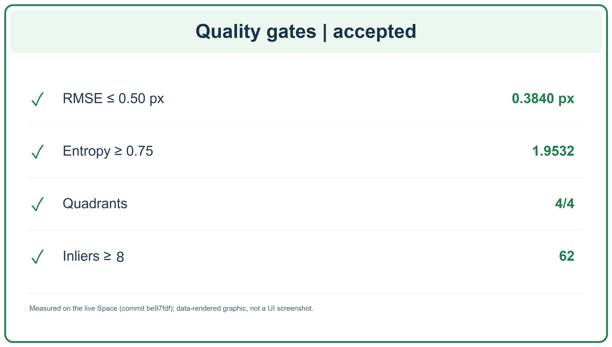
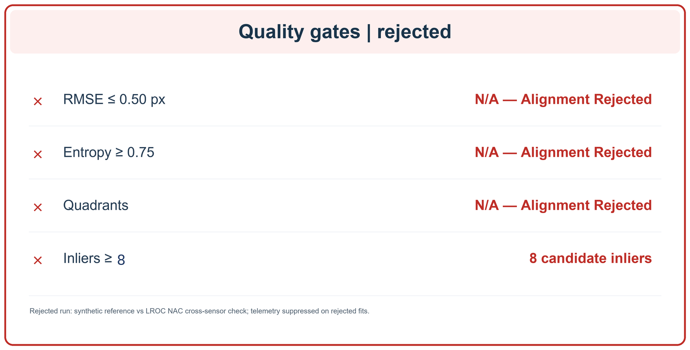

# Chandra-Align: Sub-Pixel Planetary Raster Alignment & Feature Matching Engine

[]()
[]()
[](#)
[](LICENSE)

> **Note on Live Demo:** The interactive deployment runs on a private instance for evaluation and review. For access tokens or demo credentials, please contact the repository maintainers directly.

The accuracy badge reflects the calibrated synthetic benchmark below; it is not a guarantee for every image pair. The public repository and its documentation intentionally omit private demo endpoints.

**SIH 2026 Problem Statement ID26166**
"Multi-modal, Sun angle and scale invariant image correspondence using Chandrayaan-2 optical images (OHRC, TMC and IIRS)"

**Team:** ChandraVision

CHANDRA-ALIGN registers lunar imagery across sensor, illumination, and scale differences. It supports Chandrayaan-2 OHRC, TMC-2, and IIRS products, with PDS4 labels used to interpret supported source rasters.

## How It Works

1. **Preprocessing** prepares image data for cross-sensor matching while respecting bounded image-size limits.
2. **RIFT2 primary matching** finds candidate correspondences using illumination-tolerant features.
3. **LightGlue/ALIKED deep matching** provides learned feature matching where the configured runtime supports it.
4. **SIFT + Brute-Force RANSAC CPU fallback** estimates a robust transform when the primary/deep matching path is unavailable or does not yield a usable fit.
5. **Sub-pixel refinement** attempts NCC/parabolic refinement of the RANSAC estimate. If too few correspondences survive refinement, the pipeline retains the RANSAC model rather than promoting an unsupported refined fit.
6. **Fail-safe spatial validation gate** classifies the result as **ACCEPT**, **COARSE ADVISORY**, or **REJECT** before export.

### Spatial Validation Gate

- **ACCEPT (sub-pixel):** RMSE ≤ 0.50 px, configured minimum inliers, spatial entropy ≥ 0.75, and support in at least 3 of 4 quadrants.
- **COARSE ADVISORY:** RMSE ≤ 2.50 px, configured minimum inliers, entropy ≥ 0.50, and support in at least 2 quadrants. This is a regional fit advisory, not a sub-pixel acceptance.
- **REJECT:** any result that does not meet either tier. Non-finite metrics fail closed; rejected fits do not expose transform telemetry, and invalid RMSE is reported as unavailable rather than a misleading zero.

## High-Resolution Handling

PDS4 `.IMG` products require their associated XML labels so the raster layout and metadata can be interpreted safely. Source products are processed through bounded previews/crops rather than loading every full-resolution raster into the matching pipeline. The verified OHRC run used a 4096-pixel cap; the measured TMC-2 result used browse-aligned 2048 × 2048 crops. A larger 4096 × 4000 TMC-2 crop exceeded approximately 5.8 GB of working memory in the tested CPU environment and was stopped. These measurements do not establish that arbitrary full-frame inputs fit within a fixed memory budget.

## Benchmark Status

Current measured results use the SIFT/RANSAC CPU fallback. RIFT2/LightGlue GPU validation is pending. Sub-pixel acceptance has been measured on the calibrated synthetic pair; the tested real OHRC and TMC-2 regions remain coarse advisories and do not meet the sub-pixel acceptance gate.

### Measured Results

| Pair | Tested input | RMSE | Inliers | Entropy | Spatial support | Gate result |
|---|---|---:|---:|---:|---:|---|
| Calibrated synthetic pair | 900 × 900 | 0.3840 px | 62 | 1.9532 | 4/4 quadrants | **ACCEPTED (sub-pixel)** |
| Chandrayaan-2 OHRC | Full-resolution PDS4 products, bounded 4096-pixel run | 1.5425 px | 9 | 0.9864 | 3/4 quadrants | **COARSE ADVISORY** |
| Chandrayaan-2 TMC-2 fore/nadir | Browse-aligned 2048 × 2048 crops | 1.3312 px (~5.95 m at 4.47 m/px) | 9 | 0.9911 | 2/4 quadrants | **COARSE ADVISORY** |

### Example Results

<p align="center">
	
</p>

Calibrated synthetic pair — RMSE 0.3840 px, 62 inliers, entropy 1.9532, 4/4 quadrants: ACCEPTED (sub-pixel).

The validation gate checks sub-pixel precision, spatial spread, and quadrant support on every run.

<p align="center">
	
</p>

Unreliable fits are rejected, not forced — transform telemetry is masked (N/A) on rejection.

These are results for the listed inputs and tested configurations, not a claim of general scientific accuracy or full-frame georeferencing. The real-pair fits are deliberately not presented as sub-pixel successes.

## Run Locally

Requires Python 3.10 or newer. Full-resolution Chandrayaan-2 source imagery is not included; obtain products and their labels through ISRO PRADAN.

```powershell
python -m venv .venv
.venv\Scripts\activate
pip install -r requirements.txt
python app.py
```

## Private Demo Access

The interactive deployment is private and available for evaluation/review by request. No Space address, demo endpoint, access token, or credential is published in this repository.

## Repository Layout

```text
chandra_align/          Core registration package
app.py                  Gradio application
tests/                  Automated tests
docs/                   Project and workflow documentation
scripts/                Data and evaluation utilities
notebooks/              Experiment notebooks
examples/benchmarks/    Example benchmark images
data/                   No source imagery ships here; obtain products via ISRO PRADAN
```

## License

This project is licensed under the MIT License. See [LICENSE](LICENSE).
