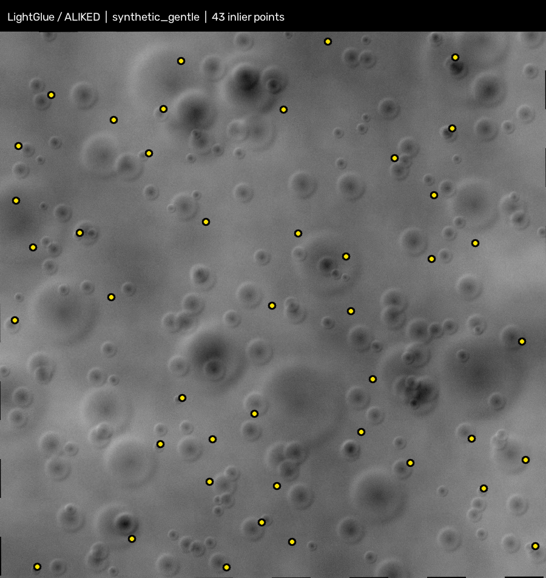
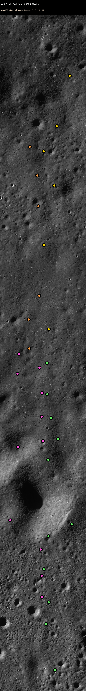

# Chandra-Align: Sub-Pixel Planetary Raster Alignment & Feature Matching Engine

[]()
[]()
[](#)
[](LICENSE)

> **Note on Live Demo:** The interactive deployment runs on a private instance for evaluation and review. For access tokens or demo credentials, please contact the repository maintainers directly.

The accuracy badge reflects the calibrated synthetic benchmark below; it is not a guarantee for every image pair. The public repository and its documentation intentionally omit private demo endpoints.

**SIH 2026 Problem Statement ID26166**
"Multi-modal, Sun angle and scale invariant image correspondence using Chandrayaan-2 optical images (OHRC, TMC and IIRS)"

**Team:** ChandraVision

CHANDRA-ALIGN registers lunar imagery across sensor, illumination, and scale differences. It supports Chandrayaan-2 OHRC, TMC-2, and IIRS products, with PDS4 labels used to interpret supported source rasters.

## How It Works

<p align="center">
	
</p>

**The pipeline in one picture:** Chandrayaan-2 products (OHRC, TMC-2, IIRS) enter with their PDS4 labels, get preprocessed into bounded crops, run through a matcher cascade, get a RANSAC fit, face a fail-closed gate, and leave as verdict + telemetry + exports. Every number below is measured — the single source of truth is [`results/table_canonical_v1.csv`](results/table_canonical_v1.csv), and [`docs/model-card.md`](docs/model-card.md) is the honest benchmark card generated from it.

### 1. Matcher cascade

<p align="center">
	
</p>

- **LightGlue/ALIKED (GPU primary)** — the validated deep-learning path: synthetic sub-pixel ACCEPT at 0.3695 px / 43 inliers; competitive real-pair results at 1.7961 px (OHRC) and 1.5558 px (TMC-2).
- **RIFT2 (non-functional, under investigation; not the primary matcher):** the Sept. 30 CPU audit and issue #1 RTX 5070 GPU validation returned 0–1 correspondences per pair, with no valid fits. Vendored but disabled unless `CHANDRA_ENABLE_RIFT2=1`. See [`results/table_issue01_gpu_validation.csv`](results/table_issue01_gpu_validation.csv).
- **SIFT + Brute-Force RANSAC (CPU fallback)** — estimates the transform as the validated CPU fallback.
- **Sub-pixel refinement** attempts NCC/parabolic refinement of the RANSAC estimate. If too few correspondences survive refinement, the pipeline retains the RANSAC model rather than promoting an unsupported refined fit.

### 2. Fail-closed spatial validation gate

<p align="center">
	
</p>

| Tier | RMSE | Inliers | Entropy | Quadrants | Meaning |
| --- | --- | --- | --- | --- | --- |
| **ACCEPT** (sub-pixel) | ≤ 0.50 px | ≥ 8 | ≥ 0.75 | ≥ 3/4 | trusted registration |
| **COARSE ADVISORY** | ≤ 2.50 px | ≥ 8 | ≥ 0.50 | ≥ 2/4 | regional fit advisory, not sub-pixel |
| **REJECT** | anything else | — | — | — | `DEGENERATE_FAILURE`; telemetry masked, reasons reported |

Non-finite metrics fail closed; rejected fits do not expose transform telemetry, and invalid RMSE is reported as unavailable rather than a misleading zero. Gate verdicts are final — confidence scores never override them.

## High-Resolution Handling

PDS4 `.IMG` products require their associated XML labels so the raster layout and metadata can be interpreted safely. Source products are processed through bounded previews/crops rather than loading every full-resolution raster into the matching pipeline. The verified OHRC run used a 4096-pixel cap; the measured TMC-2 result used browse-aligned 2048 × 2048 crops. A larger 4096 × 4000 TMC-2 crop exceeded approximately 5.8 GB of working memory in the tested CPU environment and was stopped. These measurements do not establish that arbitrary full-frame inputs fit within a fixed memory budget.

## Benchmark Status

The matcher measurements below are recorded in [`results/table_issue01_gpu_validation.csv`](results/table_issue01_gpu_validation.csv). RIFT2 returned 0, 1, and 0 correspondences for `synthetic_gentle`, `OHRC_pair`, and `TMC2_fore_nadir`, respectively; each RIFT2 row is rejected.

| Pair | Matcher | Correspondences | RMSE (px) | Inliers | Entropy | Quadrants | Gate | Runtime (s) |
| --- | --- | --- | --- | --- | --- | --- | --- | --- |
| synthetic_gentle | RIFT2 | 0 | N/A | 0 | 0.0000 | 0/4 (0,0,0,0) | REJECTED: Only 0 correspondences | 22.6662 |
| synthetic_gentle | LightGlue_ALIKED | 1276 | 0.3695 | 43 | 1.9988 | 4/4 (11,10,11,11) | ACCEPTED (Sub-Pixel Precision) | 17.7092 |
| synthetic_gentle | SIFT_RANSAC | 150 | 0.3980 | 54 | 1.9513 | 4/4 (17,8,15,14) | ACCEPTED (Sub-Pixel Precision) | 2.0875 |
| OHRC_pair | RIFT2 | 1 | N/A | 0 | 0.0000 | 0/4 (0,0,0,0) | REJECTED: Only 1 correspondences | 42.0472 |
| OHRC_pair | LightGlue_ALIKED | 553 | 1.7961 | 34 | 1.9367 | 4/4 (6,6,11,11) | COARSE ALIGNMENT (Regional Fit Advisory) | 2.2815 |
| OHRC_pair | SIFT_RANSAC | 104 | 1.5425 | 9 | 0.9864 | 3/4 (7,0,1,1) | COARSE ALIGNMENT (Regional Fit Advisory) | 4.3942 |
| TMC2_fore_nadir | RIFT2 | 0 | N/A | 0 | 0.0000 | 0/4 (0,0,0,0) | REJECTED: Only 0 correspondences | 78.0995 |
| TMC2_fore_nadir | LightGlue_ALIKED | 1537 | 1.5558 | 13 | 1.6692 | 4/4 (2,3,1,7) | COARSE ALIGNMENT (Regional Fit Advisory) | 3.1617 |
| TMC2_fore_nadir | SIFT_RANSAC | 106 | 2.2259 | 24 | 1.7296 | 4/4 (4,6,2,12) | COARSE ALIGNMENT (Regional Fit Advisory) | 7.1537 |

The independent ground-truth protocol is documented in [`docs/ground-truth-protocol.md`](docs/ground-truth-protocol.md), and its split-held-out versus independent-RMSE comparison is recorded in [`results/table_issue02_ground_truth.csv`](results/table_issue02_ground_truth.csv); OHRC and TMC-2 independent landmarks remain pending human picking.

The Issue #3 crop benchmark recorded 12 browse-mapped south-polar pairs (six OHRC and six TMC-2) in [`results/table_issue03_benchmark.csv`](results/table_issue03_benchmark.csv): LightGlue/ALIKED produced 7 COARSE and 5 DEGENERATE_FAILURE verdicts; SIFT/RANSAC produced 8 COARSE and 4 DEGENERATE_FAILURE verdicts. No row was ACCEPTED; `gt_rmse` remains empty pending independent landmarks, and these windows do not cover mare terrain.

Issue #4 measured three-level coarse-to-fine matching on the same 12 pairs: 5 matcher-pair verdicts improved, 16 were unchanged, and 3 regressed, so it remains opt-in; paired RMSE and runtime measurements are in [`results/table_issue04_coarse2fine.csv`](results/table_issue04_coarse2fine.csv). A native-resolution 8192×8192 OHRC tiled run used 2,482 MiB peak RSS versus 5,123 MiB for the eager resized run (51.6% lower) and returned REJECTED; details are in [`results/issue04_tiled_memory.json`](results/issue04_tiled_memory.json). Ground-truth RMSE is unavailable for this demonstration.

### Cross-modal breakthrough: first IIRS↔TMC-2 registration

SIFT-family matchers failed on every IIRS↔TMC-2 attempt (1–25 Lowe matches, none surviving the gate; see [`docs/phase9-report.md`](docs/phase9-report.md)). A detector-free dense matcher (LoFTR, `chandra_align/xmodal/loftr_arm.py`) broke through on the destriped 2852.6 nm band vs common-GSD TMC-2: **2,242 correspondences → 748 inliers after sub-pixel refinement → RMSE 1.37 px → COARSE_ADVISORY**, Gate 3 passing, all four quadrants active. Full account with caveats in [`docs/phase9-loftr-addendum.md`](docs/phase9-loftr-addendum.md). COARSE, not sub-pixel — reported as measured.

### Example Results

<p align="center">
	
</p>

LightGlue/ALIKED on the calibrated synthetic pair — RMSE 0.3695 px, 43 inliers, entropy 1.9988, 4/4 quadrants: ACCEPTED (sub-pixel), measured on RTX 5070.

<p align="center">
	
</p>

RIFT2 produced 0 correspondences on the same input — rejected with transform telemetry masked (N/A). The failed primary is reported, not hidden.

<p align="center">
	
</p>

LightGlue/ALIKED, calibrated synthetic pair — checkerboard blend of the accepted registration (RMSE 0.3695 px, 43 inliers, 4/4 quadrants). Measured on RTX 5070.

<p align="center">
	
</p>

LightGlue/ALIKED, OHRC pair — 34 inliers across all four quadrants at 1.7961 px: COARSE advisory, not sub-pixel. Measured on RTX 5070.

## Run Locally

Requires Python 3.10 or newer. Full-resolution Chandrayaan-2 source imagery is not included; obtain products and their labels through ISRO PRADAN.

```powershell
python -m venv .venv
.venv\Scripts\activate
pip install -r requirements.txt
python app.py
```

### Docker

- **GPU (full pipeline):** `docker build -t chandra-align .` — CUDA 12.1, runs the Gradio app.
- **CPU slim (fallback path + tests):** `docker build -f Dockerfile.cpu -t chandra-align:cpu .` — no CUDA, runs the SIFT/RANSAC CPU path and the batch CLI.

```bash
docker run --rm chandra-align:cpu --help
```

## Private Demo Access

The interactive deployment is private and available for evaluation/review by request. No Space address, demo endpoint, access token, or credential is published in this repository.

## Repository Layout

```text
chandra_align/          Core registration package
app.py                  Gradio application
tests/                  Automated tests
docs/                   Project and workflow documentation
scripts/                Data and evaluation utilities
notebooks/              Experiment notebooks
examples/benchmarks/    Example benchmark images
data/                   No source imagery ships here; obtain products via ISRO PRADAN
```

## License

This project is licensed under the MIT License. See [LICENSE](LICENSE).
