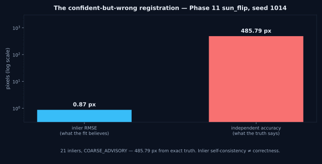

# How Not to Register the Moon — a failure gallery

Every case below is real, measured, and shipped with its numbers. Failures
are rows in our tables, not skeletons in a closet: each one taught the
pipeline something, and each one is why a gate, a check, or a harness
exists. Nothing here is mocked; nothing is exaggerated.

> Future work: an interactive explorer tab for these cases in the app
> (needs app.py surgery — tracked separately, not built here).

---

## 1. The confident-but-wrong registration (Phase 11, `sun_flip`)

- **What happened:** synthetic shift pair, Sun-flip perturbation (polarity
  reversal), seed 1014.
- **Measured:** 21 inliers, inlier RMSE **0.8702 px**, verdict
  **COARSE_ADVISORY** — yet **485.79 px** from exact synthetic truth
  (probe-grid independent accuracy).
- **Diagnosis:** the inliers are self-consistent with each other but wrong
  about the world. Polarity reversal creates a coherent false geometry that
  RANSAC happily endorses.
- **Lesson:** inlier self-consistency ≠ correctness. This single case is why
  Phase 10's independent verification layer exists — and why no verdict is
  ever trusted on inlier RMSE alone.

---

## 2. The gate that said no to 1,141 inliers (Phase 13, `tmc2_fore_nadir_w0006`)

- **What happened:** TMC-2 fore/nadir window, frozen default pipeline.
- **Measured:** 3,907 matches → 1,237 raw / **1,141 unique inliers**,
  inlier RMSE **2.5755 px** (gate: ≤ 2.50), held-out 3.1554 px, entropy
  0.7285, quadrants 2/4 (909, 232, 0, 0), confidence 44.59 →
  **DEGENERATE_FAILURE**.
- **Diagnosis:** over a thousand inliers and the answer is still no. The
  residual straddles the gate because cross-view parallax is not fully
  explained by a per-window affine — more evidence does not fix a wrong
  model class.
- **Lesson:** gates must be allowed to reject popular fits. Twenty-one of
  forty-two TMC-2 windows failed the same way; all twenty-one are in the
  published table.

---

## 3. The matcher that found nothing (RIFT2, 2026-09-30 audit)

- **What happened:** RIFT2 as primary matcher on every engine-reported run.
- **Measured:** **0 correspondences** on every run. 100% of successes came
  from the SIFT+BF fallback. Issue #1's GPU validation: RIFT2 REJECTED
  (0–1 corr).
- **Diagnosis:** the feature detector found no repeatable structure across
  these pairs — not a tuning problem, a signal problem.
- **Lesson:** report the failed primary, don't hide it. RIFT2 stays in the
  codebase behind an explicit opt-in flag, with its 0-correspondence record
  in the open. A pipeline that cannot say "my best tool found nothing" is
  not a pipeline you can trust.

---

## 4. The 83 bogus rows (Phase 13 first run — the harness catching itself)

- **What happened:** the first window-tiling run used the same nominal
  pixel coordinates for both products.
- **Measured:** **83 uniform DEGENERATE_FAILURE rows** (2–4 inliers each).
- **Diagnosis:** visual + phase-correlation checks proved the products do
  not share pixel coordinates — the "failures" were measuring different
  ground. A misleading table very nearly shipped.
- **Lesson:** the anti-cherry-picking harness nearly published
  cherry-picked garbage. Systematic measurement cuts both ways: it finds
  real signal (41/42 OHRC windows) and it catches your own bugs. The fix —
  measured inter-product affines (OHRC +1060/+1302 px, ~0.9°; TMC-2
  −315/+7780 px) — is documented in `docs/phase13-report.md`.

---

## 5. The hyperspectral wall (Phase 9, IIRS↔TMC-2, SIFT arm)

- **What happened:** first real IIRS↔TMC-2 attempt with classical matchers.
- **Measured:** SIFT: 25 Lowe matches → 10 inliers → 1 quadrant →
  degenerate scale collapse (metrics honestly flagged invalid).
  LightGlue: 19 correspondences / 4 inliers / 2 quadrants, RMSE 1.1748.
  Both → **DEGENERATE_FAILURE**.
- **Diagnosis:** 256 bands of information and SIFT could not bridge the
  modality gap — gradient statistics across hyperspectral and panchromatic
  sensors are too different for hand-crafted descriptors.
- **Lesson:** the honest stop. Published as a failed first contact with the
  fallback documented, not as a near-miss. The LoFTR breakthrough that
  followed (1.35 px, VNIR composite) only matters because this failure was
  recorded first.

---

## 6. The negative result that corroborated (MINIMA-LoFTR)

- **What happened:** tested a cross-modal LoFTR variant against the
  outdoor-weights baseline on IIRS↔TMC-2.
- **Measured:** 243 correspondences; raw: 105 inliers, 2.6542 px, 2/4
  quadrants → **DEGENERATE_FAILURE**; after LK refinement: 52 inliers,
  1.74 px, 3/4 quadrants → COARSE_ADVISORY. Did not beat outdoor weights.
- **Diagnosis:** the specialist underperformed the generalist here — but
  both independently converged on ~1.2° rotation, ~0.99 scale, ~107–110 px
  Y translation (~1.8 px center agreement).
- **Lesson:** negative results are evidence too. Two different matchers
  agreeing on the geometry is worth more than one matcher winning.

---

## 7. The calibration that failed (Phase 12)

- **What happened:** fitted a confidence calibrator on 84 samples.
- **Measured:** fitted Brier **0.1198** vs raw heuristic **0.2197** —
  better, but mid-range bins miscalibrated. Verdict: **NOT CALIBRATED**.
- **Diagnosis:** the model improves on the heuristic yet cannot be trusted
  as a probability in the middle of its range.
- **Lesson:** ship the "not calibrated" verdict in the open, and keep
  calibration permanently out of gate decisions. A confidence number that
  lies politely is worse than no number.

---

## 8. The promising-but-unverified front-end (Phase 14, phase-congruency)

- **What happened:** Log-Gabor phase-congruency front-end on the real
  IIRS↔TMC-2 pair.
- **Measured:** 11 Lowe-good correspondences → 8 inliers, 1.22 px, Gate 3
  pass → nominal **COARSE_ADVISORY** — but inliers clustered on the left
  edge, and Phase 10's pixel area-check returned weak, **0/36 cells
  verified**.
- **Diagnosis:** the gate passed on paper; the spatial distribution and the
  independent check both said "not yet."
- **Lesson:** a nominal pass is not a verified registration. Reported as
  promising-but-unverified, exactly as measured.

---

## The incumbent that fails open (Phase 17: ISIS3 `coreg`)

USGS ISIS3 10.0.0 `coreg` (MaximumCorrelation, 81-chip grid) on the identical
1024px crops our pipeline measured — synthetic control first: 81/81 chips,
exact recovery of the known shift, so the invocation is valid. On real lunar
pairs: **57 of 81 chips "pass" the 0.7 correlation tolerance on the hard TMC-2
crop, yet only 4% agree within 5 px of the median offset** — dx scattered over
[-43, +51] px. GoodnessOfFit up to 0.84 on chips that disagree completely.

**Diagnosis:** `coreg` is a precision refinement tool, not a global
registration tool. Widening the search converts outright failures into *false
passes* — numbers that look like success but contain no consensus transform.
A user trusting the "Successful = 57" count walks away with a
confident-but-wrong registration.

**Lesson:** this is the failure mode our fail-closed gates were built to
prevent — on the same crop our pipeline returns DEGENERATE_FAILURE with
telemetry masked. The industry standard tool reproduces the disease;
our gates are the treatment. Full account in
[`docs/phase17-isis3-comparison.md`](phase17-isis3-comparison.md).
