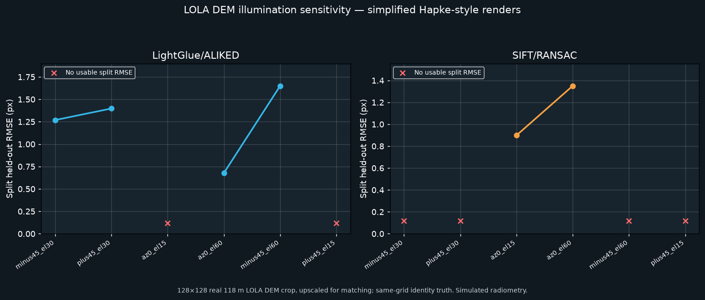

# Issue #11: sun-angle sensitivity harness

## Data and provenance

The harness reads a bounded window from the public USGS Astrogeology LOLA
global DEM product
[`Lunar_LRO_LOLA_Global_LDEM_118m_Mar2014.tif`](https://planetarymaps.usgs.gov/mosaic/Lunar_LRO_LOLA_Global_LDEM_118m_Mar2014.tif).
The product page identifies the raster as a global LOLA elevation model at
118 m/pixel; the [PDS LOLA GDR documentation](https://ode.rsl.wustl.edu/moon/pagehelp/Content/Missions_Instruments/LRO/LOLA/GDR/GDRDEM.htm)
describes the data as gridded elevation models and documents scale application.

The committed subset is a 128×128 pixel window at raster offset `(x=45952,
y=22912)`, with the source's stored 16-bit samples multiplied by 0.5 m. It
covers approximately 15 km on a side near the equator. The exact raw-window
SHA-256 is `3e24c5406706e457b3efc32d735cdaf90614b0da3464e52e100c9ada87e20c1a`.
The subset is preserved in `results/issue11_lola_dem_tile.npz`; the run records
and table are `results/issue11_sunangle_runs.json` and
`results/table_issue11_sunangle.csv`.

## Rendering model

For each DEM sample, the script estimates a local surface normal from the
elevation gradient. For solar direction `s`, nadir viewing direction `v`, and
normal `n`, it uses `μ0=max(n·s,0)` and `μ=max(n·v,0)`, then a simplified
Hapke-style reflectance:

`r = (w / 4π) · μ0/(μ0+μ) · [P(g) + H(μ0)H(μ) − 1]`

with fixed single-scattering albedo `w=0.55`, phase function
`P(g)=1+0.2 cos(g)`, and approximation
`H(x)=(1+2x)/(1+2x√(1−w))`. All renders share a single 1st–99th percentile
display stretch. The terrain is rendered once at `(azimuth=0°, elevation=30°)`
and under six variants: azimuth `−45°` and `+45°` at 30° elevation, elevation
15° and 60° at 0° azimuth, plus `(−45°,60°)` and `(+45°,15°)`. Both
LightGlue/ALIKED and SIFT/RANSAC compare each variant against the reference.

This is a sensitivity probe, not a full Hapke photometric correction or an
orbital-image simulation. It omits calibrated albedo, macroscopic roughness,
opposition surge, cast shadows, atmospheric effects, camera geometry, and
sensor noise. The small DEM crop is upscaled for feature matching; that adds
display samples, not terrain detail. The renders share an exact identity map,
so the table also reports fit error against identity on a fixed 3×3 grid of
check locations independent of detected matches. Split-held-out RMSE remains
reported separately.

## Results

Across 12 variant/matcher runs, LightGlue/ALIKED produced 4 `COARSE_ADVISORY`
and 2 `DEGENERATE_FAILURE` verdicts. SIFT/RANSAC produced 2 `COARSE_ADVISORY`
and 4 runs with no usable correspondence candidate (`REJECTED`). Split-held-out
RMSE was measurable on four LightGlue runs (0.67815–1.65028 px) and two SIFT
runs (0.89849–1.35071 px); the other runs had no check-point RMSE. The measured
identity-grid RMSE ranged from 0.55103 to 3.57957 px. Thus acceptable-looking
split-held-out values did not guarantee agreement with the known identity
transform on this small patch.

Run `python scripts/run_issue11_sunangle.py` to replay the match comparisons
from the committed DEM tile. If the tile is absent, the script reads only the
recorded 128×128 window from the official USGS GeoTIFF using GDAL's range
requests; it does not download the full global raster. It then regenerates the
CSV, raw JSON, and plot.
